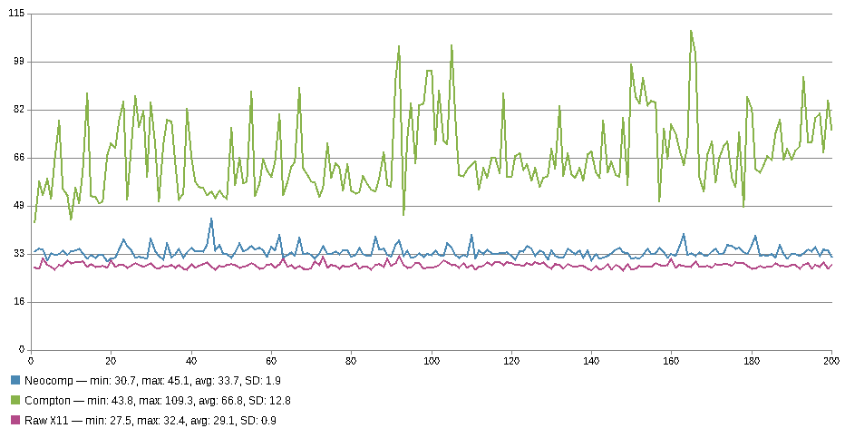

# NeoComp (Compton)


__NeoComp__ is a fork of __Compton__, a compositor for X11

NeoComp is a (hopefully) fast and (hopefully) simple compositor for X11,
focused on delivering frames from the window to the framebuffer as
quickly as possible.

I'm currently running this compositor as my daily driver, and it seems
mostly stable. It crashes once in a while when I do silly stress-testy
stuff, but for normal usages it's pretty alright.

The compositor is far enough along to benchmark, and since part of the
goal is being faster than compton, it only makes sense to actually
publish and discuss them. For windows that deliberately ask for raw X11
(no compositing) we support selective redirection, meaning those windows
should have raw X11 performance. for everything else, we expect
a (small) performance hit. To measure this hit, I've used typometer and
termite to compare the input latency for compton, neocomp, and raw X11.
The results are seen in the graph below.



Since the purpose of the test is low input delay, compton was run
without vsync. The results for vsync-enabled looks similar, but more
stable. Neocomp has no support for running without vsync, so it has
vsync enabled. The tests were done on my normal configuration, which
means blurring background is enabled, shadows are enabled, dimming is
enabled, and compton uses the glx backend.

It might be possible to tune compton to be faster, but that's not the
point of the test.

Neocomp also has a bunch of nice debugging features. It features
instrumentation for a custom profiler, which outputs json readable by
the tracer in chrome. It also has debug rendering modes, which draws
some internal state to the display (making it easier to debug with frame
dissection tools like apitrace).

There's a lot of other features in here as well, like bezier curve
fading, shader customization, and compliant texture binding (other
compositors seem to break the spec by not rebinding the texture when the
contents change, and not grabbing the xserver for the duration of the
bind). Some day I might list all the features.

## Building

To build, make sure you have the dependencies (yeah I know) then run:

```bash
# Make the main program
$ make
# Make the man pages
$ make docs
# Install
$ make install
```

## Usage

The man pages are completely out of date, but still your best bet. Some
options from the man pages have been removed, and some added. You might
have to look in the code. I'd love to accept contributions on this
front.

## License

I don't know of the lineage behind Compton. All contributions made by me
are GPL. If any previous contributor would like to claim ownership over
some part and dispute the license, please open an issue.

NeoComp is licensed under GPLv3
